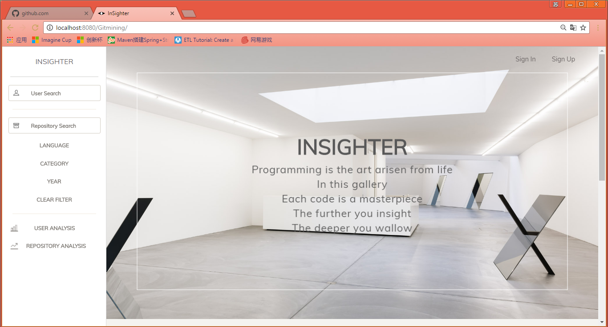
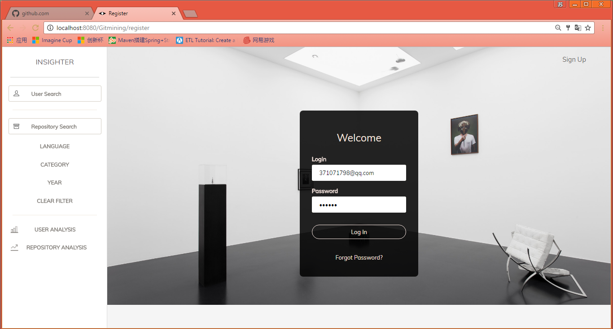
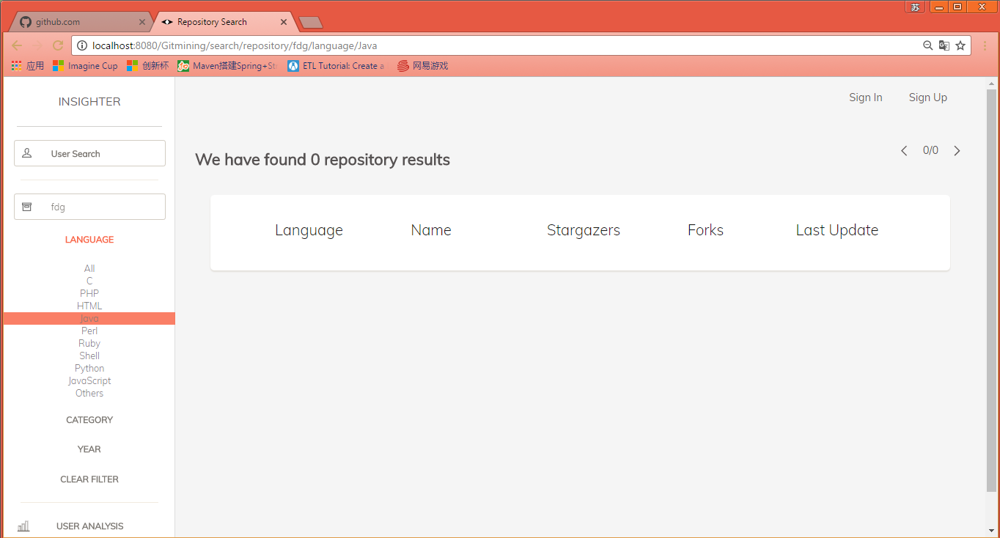
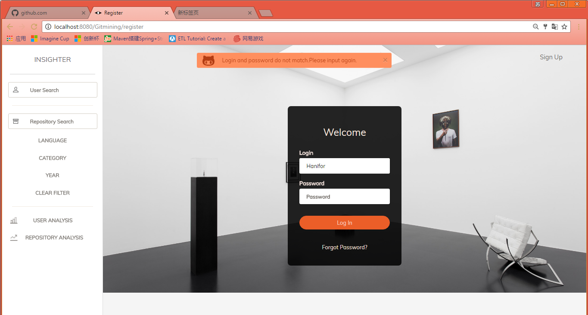

# SE3
GitMining--Project Study Website
## Project Introduction
This website is developed to help programmers to learn how to utilize the source on Github more efficiently. Based on the historical repositories a user learned, combined with his or her programming ability, the website will recommend the most suitable as well as superior repositories.
## Project Screenshot
#### Home Page

#### Login Page

#### Search Page

#### Timely Notification

